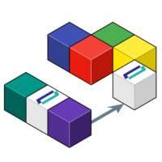

# iris2bq - A utility to move InterSystems IRIS Data to Google Cloud Platform's Big Query
 <br/>



## What
Let's say IRIS is contributing to workload for a Hospital system, marshalling DICOM, HL7, FHIR, or CCDA.  Natively, IRIS persists these objects in various stages of the pipeline via the nature of the business processes and anything you included along the way.

Lets send that up to Google Big Query to augment and compliment the rest of our Data Warehouse data and ETL (Extract Transform Load) or ELT (Extract Load Transform) to our hearts desire.


## Why
* Were capturing a wealth of transactional Healthcare data in our IRIS for Health clusters. 
* Our Data Warehouse is in Google Cloud Platform Big Query (GCP).
* Our Data Science team asked us to put in a process to automatically send transactional data to the Data Warehouse.

## Who

###  Technical Actors

* [InterSystems IRIS for Health](https://www.intersystems.com/resources/detail/intersystems-iris-for-health/)
* [Google Cloud Platform - Big Query](https://cloud.google.com/bigquery/)


## How
This `iris2bq` utility has got your back.
<p align="center">
  
</p>

Exactly how again?
- It exports the data from IRIS into DataFrames
- It saves them into GCS as `.avro` to keep the schema along the data: this will avoid to specify/create the BigQuery table schema beforehands.
- It starts BigQuery jobs to import those `.avro` into the respective BigQuery tables you specify.

> Note: internally, it is using the Spark framework for the sake of simplicity, but no Hadoop cluster is needed. It is configured as a "local" cluster by default, meaning the application and is running standalone.

## How Its Implemented

1. IRIS for Health is implemented as a Docker Container and deployed locally running Docker.
2. Google Cloud Platform needs a project, with a service account and the account able to use Big Query and Google Cloud Storage.
3. `iris2bq` synching those two places above ^^.


## Let's Go

### How to run it
- :coffee: Ensure you have a Java SDK on your system `OpenJDK1.8` worked for us.
- :arrow_down: Download the latest release [iris2bq](https://github.com/basenube/iris2bq/releases/tag/v1.0.5)
- :cloud: Create a Service Account to Google Cloud which has access to GCS and BigQuery, and create a json key
- :page_facing_up: Create a configuration file `configuration.conf` for iris2bq to know where to grab and put the data:
```
jdbc {
  url = "jdbc:IRIS://127.0.0.1:51773/USER"
  user = "_SYSTEM"
  password = "flounder"
  tables = [ "people" ]
}

gcloud {
  project = "iris2bq-demo"
  service-account-key-path = "service.key.json"
  bq.dataset = "iris2bqdemods"
  gcs.tmp-bucket = "iris2bqdemobucket"
}

```
- Run the application specifying the config file:
```
GOOGLE_CLOUD_PROJECT=iris2bq-demo GOOGLE_APPLICATION_CREDENTIALS=/path/to/service-account-key.json ./bin/iris2bq -Dconfig.file=configuration.conf
```
- Done!

Add this to a scheduler (Airflow, crontab, etc) every 10min and enjoy your JOINs in BigQuery of your IRIS Data.


## Give this a shot yourself

If you want to give this a shot on your own, here is a quick way to get up and running with InterSystems IRIS for Health.  You will need Docker installed on your system.

<details><summary><b>Show IRIS Deployment Instructions</b></summary>

1. Build Container:

    ```sh
    $ cd demo
    $ bash iris-docker.sh

    ```

2. Create a GCP project with `Big Query` and `Google Cloud Storage` API's enabled:

    ```sh
    $ cd demo
    $ terraform init
    $ terraform plan
    $ terraform apply
    ```

</details>

### Development

Got a better idea?  See a horrific bug? Grab `sbt` for your system.

<details><summary><b>Show iris2bq Development Instructions</b></summary>

1. Build:

    ```sh
    $ git clone https://github.com/basenube/iris2bq.git
    $ cd iris2bq
    // Develop, Develop, Develop
    $ sbt stage
    ```


</details>


## Thank You

Thanks to our valued partners [InterSystems](https://www.intersystems.com) and [Google Cloud Platform](https://cloud.google.com) for the feedback and support.  

## Credits

We dont pretend to be very good at Scala.  Most of the original guts of this thing come out of the great work
of these hackers at [Powerspace](https://powerspace.com/en/).  We have used a similar version of this they developed for Postgres to lift transactional data to a datawarehouse for a customer without issue for over a year now.